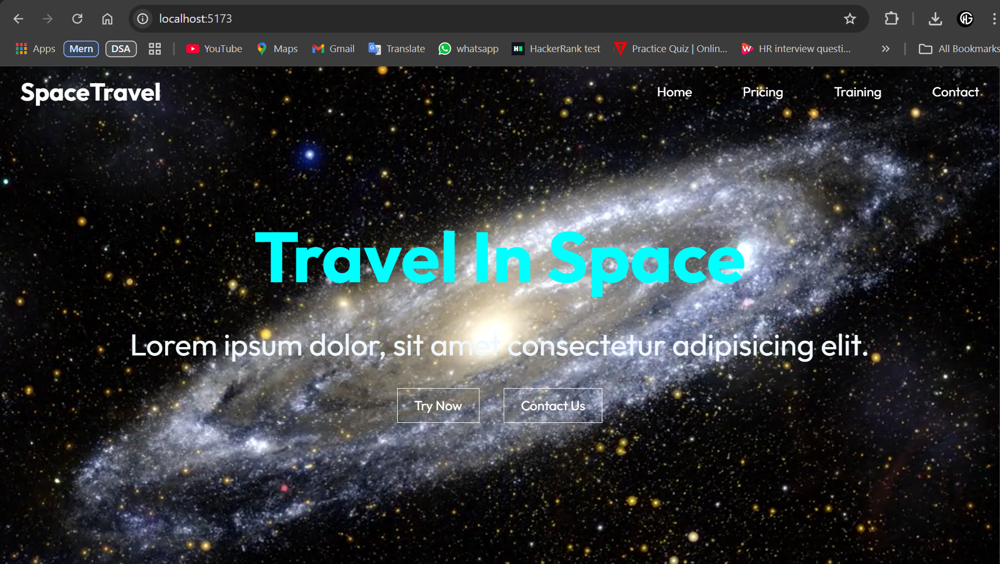
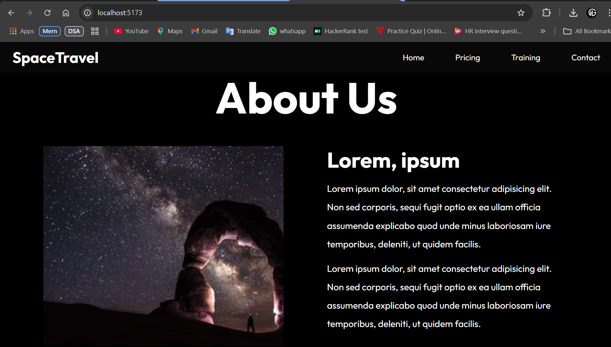
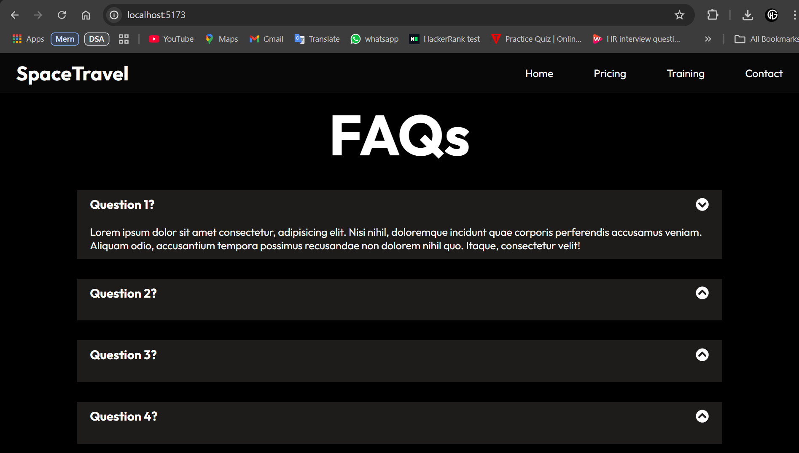
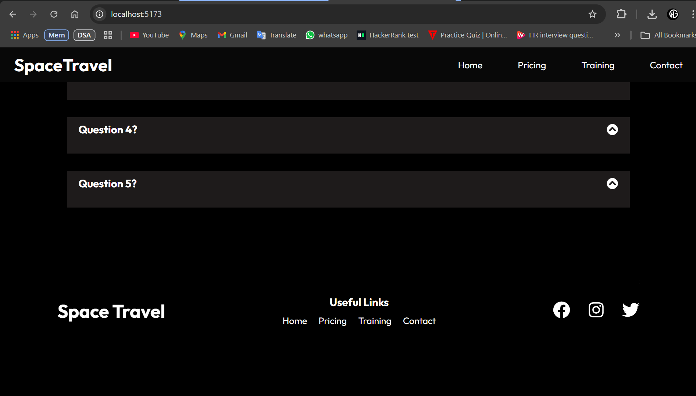
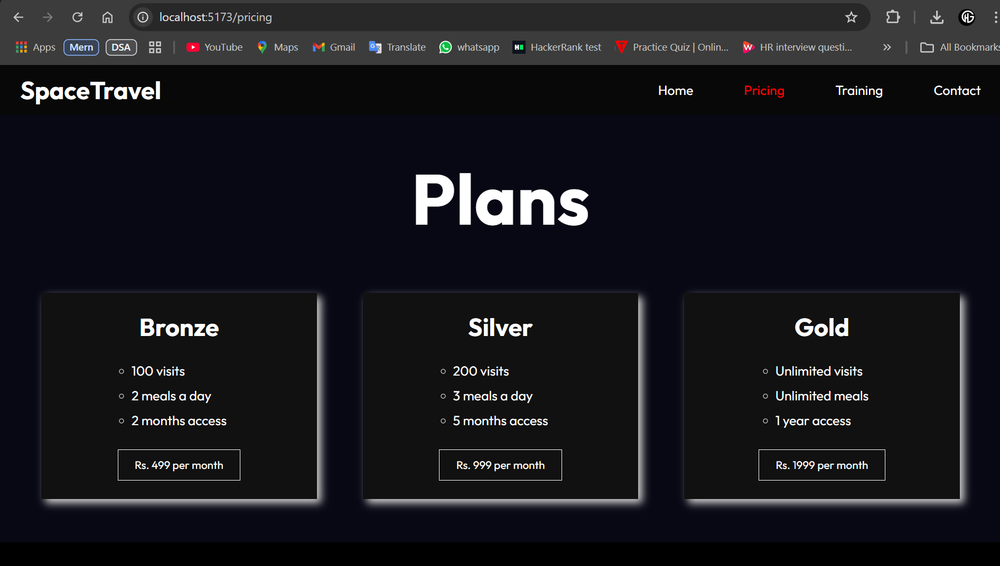
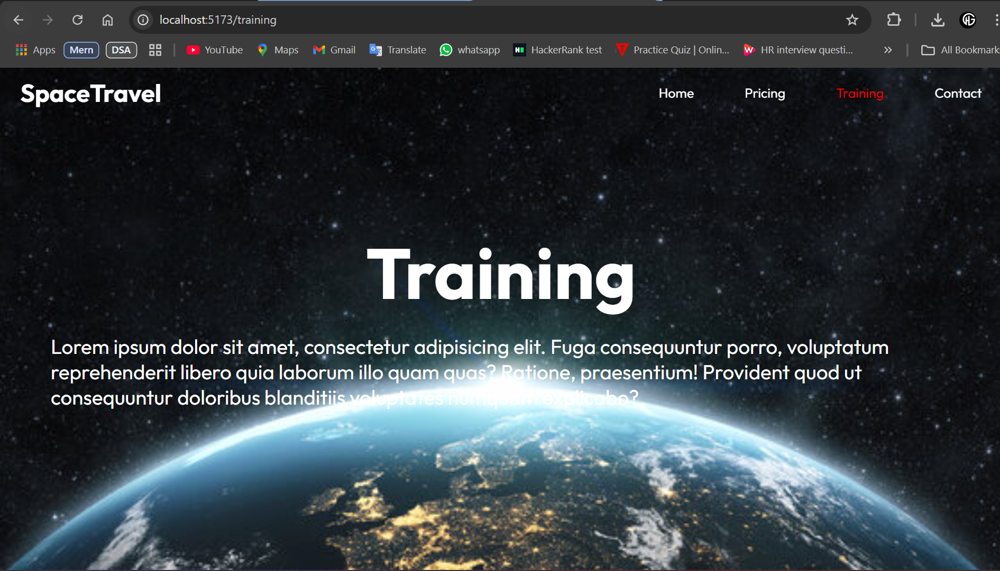
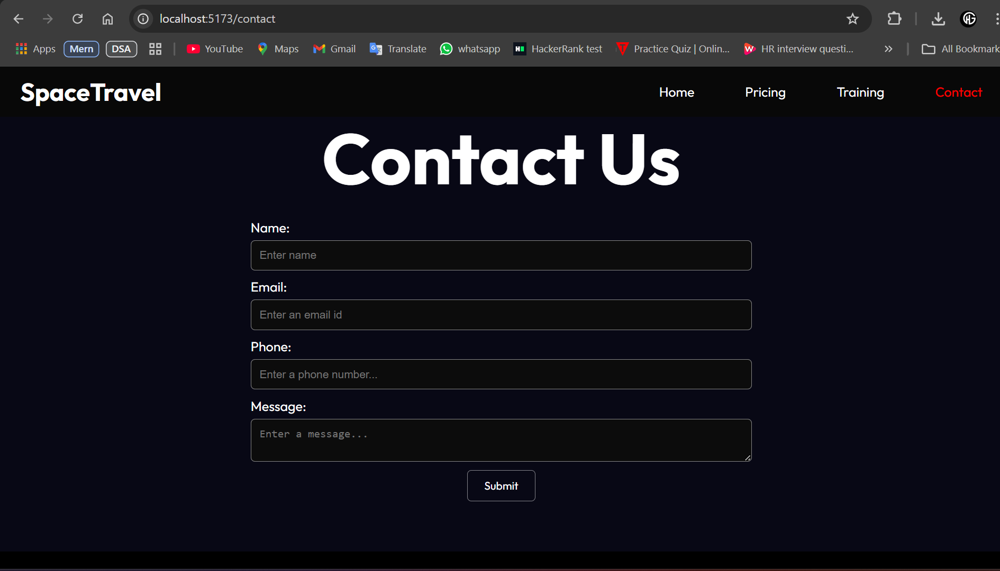

# Space Travel (Front-end) Website:

- It is a website created using Vite + React + Javascript.
- It uses React Router library for navigating to different pages;
- It has 4 pages:
    1. Home Page
    2. Pricing Page.
    3. Training Page
    4. Contact Page

- It has following component:
    1. Navbar - for Navigating Links
    2. Header - for reusable header section for Various pages
    3. Footer - for footer section for each page

- It uses window.scrollTo to scroll to header of a page on navigating.
- It uses a custom Hook - useForm() : for form validation

- It uses react-icons library for various icons.

- It uses Modal to show a pop-page on button click.
- It uses Accordian in FAQs section for collapse/expand answer-box on click.

## Screenshots:

 

 

 

 

 

 

 